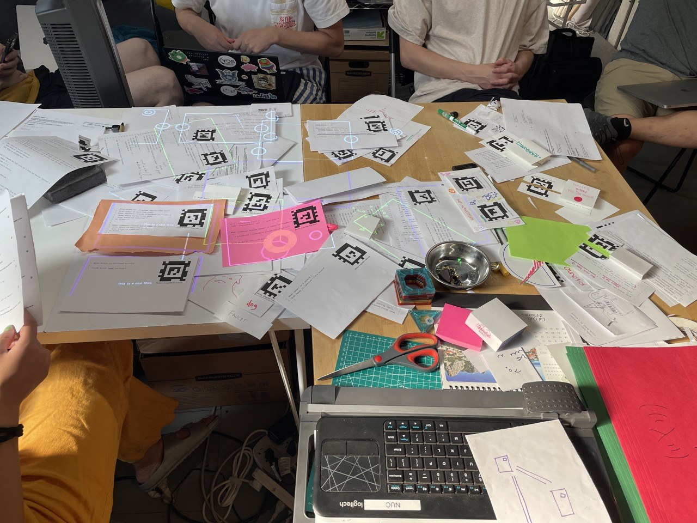
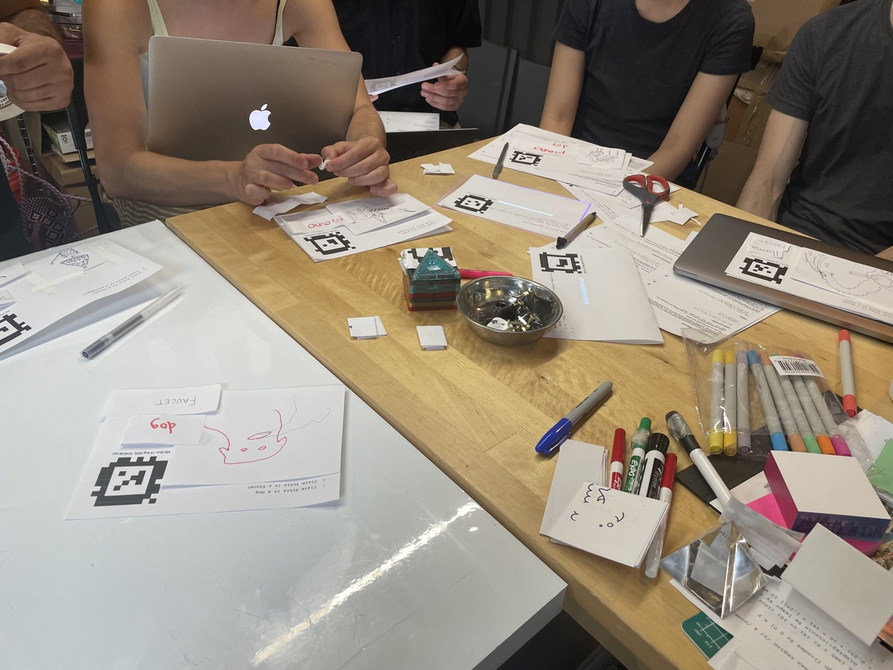
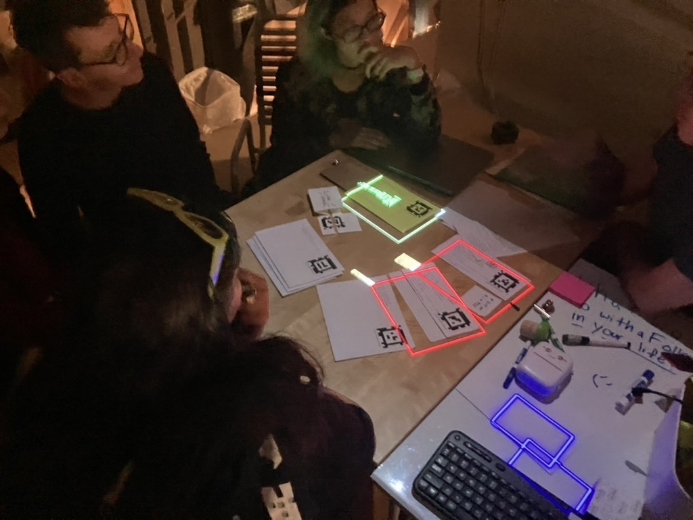

## System name:

- *folk0*

## City:
- Brooklyn, NY, USA

## How to connect via mDNS:

- `folk0.local:4273`

## System setup:

- 
- 
- 

## Program gallery:
- TODO: "Hello $name!" Guestbook program
- TODO: Metrics program
- TODO: Spritesheet animation
- TODO: Spring animation
- TODO: Full screen 
- TODO: Tidal Cycles cards
  - Documentation: [video of folks playing with the cards](https://www.youtube.com/watch?v=9Jik_CfcaGA)